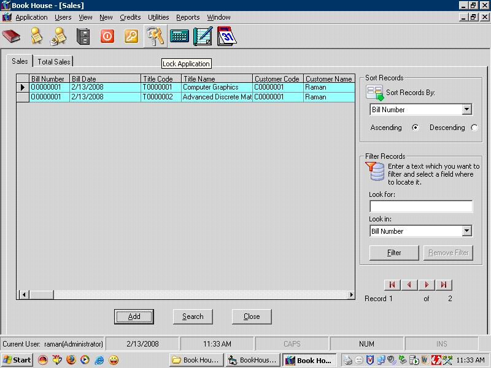

<div align="center">

## Book House Inventory Management\(Update 16th Feb\. 2008\)


</div>

### Description

This Project manages the Books inventory of a Book Shop or Book House(or whatever names it is called by).It includes trasactions like sale and purchase of books, managing customers,suppliers,subject categories etc. This project also demonstrates creating scrolling forms and displays scroll bars when form is resized.

Update 16th Feb. 2008: fixed a minor bug in search form. Now I can really think of the software to be error free.

This software has been redesigned in certain aspects and almost all errors have been eliminated.I have made utmost attempt to make it error free and a perfect one. However I will keep on removing errors as and when these are discovered. So please help me find out any errors discovered by you so that it turns out to be a perfect one. Thanks a lot to PSC-a heaven for aspiring programmers and Thanks to all users for their valuable feedback.Please don't forget to vote my project.
 
### More Info
 


<span>             |<span>
---                |---
**Submitted On**   |2008-02-15 10:45:56
**By**             |[Raman Mehta](https://github.com/Planet-Source-Code/PSCIndex/blob/master/ByAuthor/raman-mehta.md)
**Level**          |Intermediate
**User Rating**    |4.7 (33 globes from 7 users)
**Compatibility**  |VB 6\.0
**Category**       |[Complete Applications](https://github.com/Planet-Source-Code/PSCIndex/blob/master/ByCategory/complete-applications__1-27.md)
**World**          |[Visual Basic](https://github.com/Planet-Source-Code/PSCIndex/blob/master/ByWorld/visual-basic.md)
**Archive File**   |[Book\_House2101992162008\.zip](https://github.com/Planet-Source-Code/raman-mehta-book-house-inventory-management-update-16th-feb-2008__1-70090/archive/master.zip)

### API Declarations

```
Private Declare Function GetWindowLongA Lib "user32" (ByVal hwnd As Long, ByVal nIndex As Long) As Long
Private Declare Function SetWindowLongA Lib "user32" (ByVal hwnd As Long, ByVal nIndex As Long, ByVal dwNewLong As Long) As Long
Private Declare Function SetLayeredWindowAttributes Lib "user32" (ByVal hwnd As Long, ByVal crey As Byte, ByVal bAlpha As Byte, ByVal dwFlags As Long) As Long
Private Const GWL_EXSTYLE = (-20)
Private Const WS_EX_LAYERED = &amp;H80000
Private Const LWA_ALPHA = &amp;H2&amp;
```


